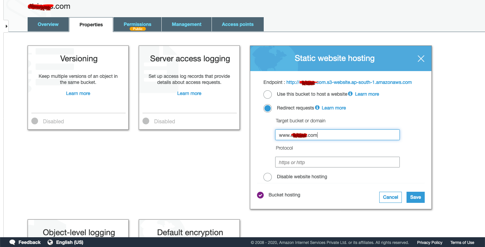
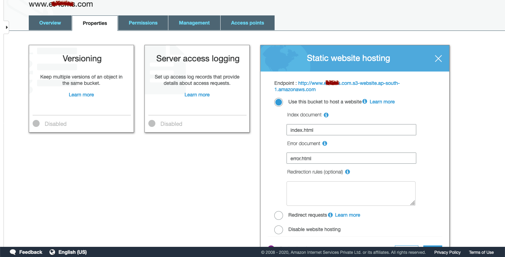
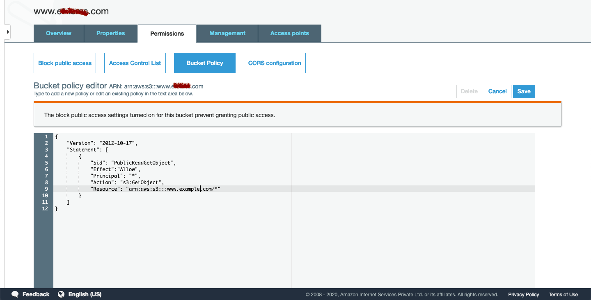
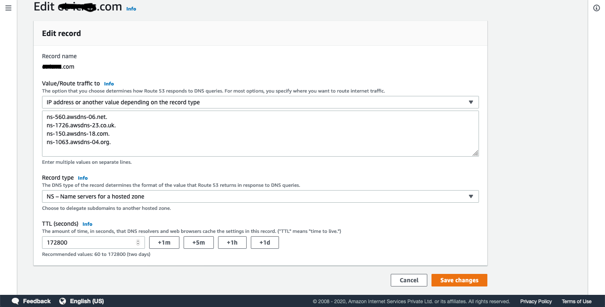

# Host static website using S3

1. Create two S3 bucket with your domain name `(www and non-www)`
	
	example.com
	
	www.example.com

2. Configure `non-www` bucket to redirect to `www` bucket

  

3. Upload your web content to www bucket

4. Configure www bucket for web-hosting by selecting `static website hosting`

 

5. Make www bucket as `public` and add the below `policy`

```
{
    "Version": "2012-10-17",
    "Statement": [
        {
            "Sid": "PublicReadGetObject",
            "Effect":"Allow",
            "Principal": "*",
            "Action": "s3:GetObject",
            "Resource": "arn:aws:s3:::www.example.com/*"
        }
    ]
}
```
  
  
  

6. Create AWS route53 public hosted zone with the same name as the domain name (Non-WWW).

7. Update GoDaddy NS with AWS provided NS (without ending dot(.).

  

8. In AWS Route53 
	
	create `A Type`  recordset for the non-www domain and select Alias Checkbox to Yes and point it to S3 main bucket
	
	create `A Type` recordset for www subdomain and point to S3 www bucket.
	
9. Access your web site from browser. Enjoy

