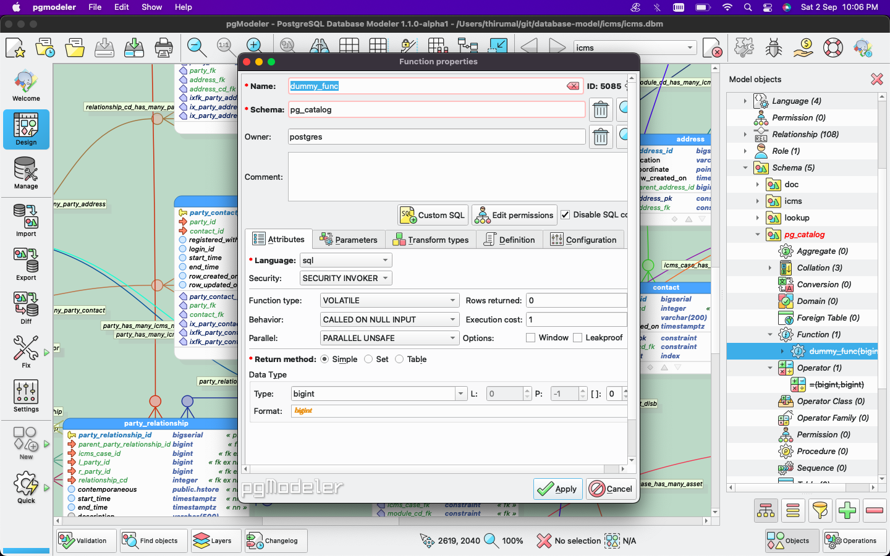
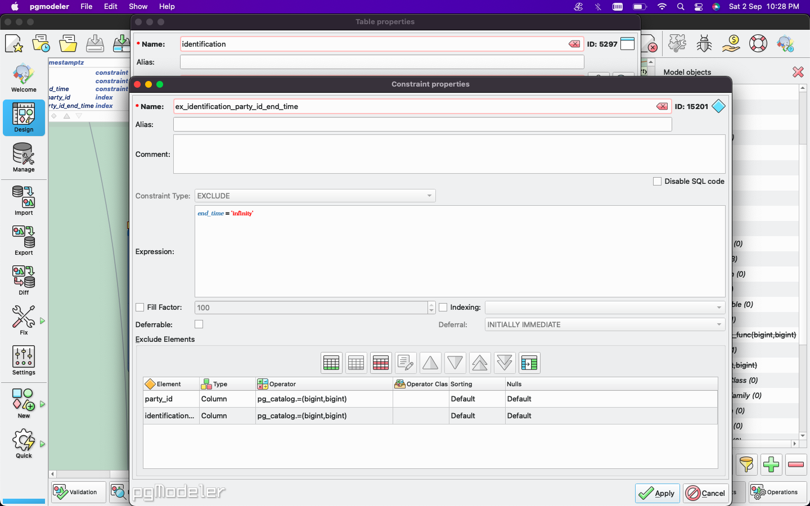
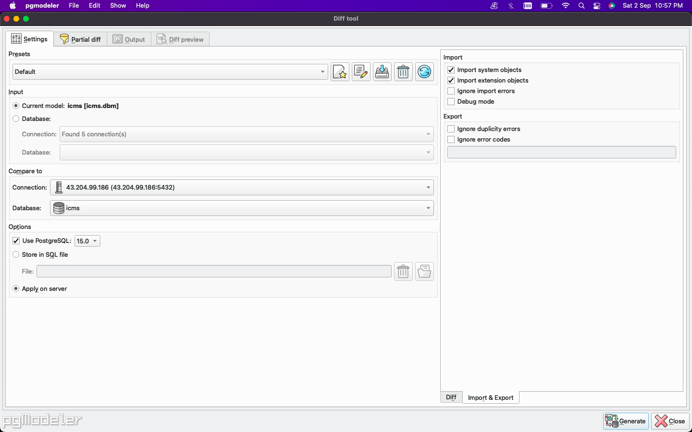

# Exclusion Constraints in Pgmodeler..

1. Create Extension
2. Create dummy function 
3. Create dummy operator
4. Add constraint to table

### Create Dummy Function:

1. Click on `Objects` -> `projects` -> `schema` -> `pg_catalog` -> `function` -> `Create function` with parameterm & return type



```XML
<function name="dummy_func" sql-disabled="true"
		window-func="false"
		returns-setof="false"
		behavior-type="CALLED ON NULL INPUT"
		function-type="VOLATILE"
		security-type="SECURITY INVOKER"
		parallel-type="PARALLEL UNSAFE"
		execution-cost="1"
		row-amount="0">
	<schema name="pg_catalog"/>
	<role name="postgres"/>
	<language name="sql"/>
	<return-type>
	<type name="bigint" length="0"/>
	</return-type>
	<transform-types names="bigint"/>
	<parameter name="p1">
		<type name="bigint" length="0"/>
	</parameter>
	<parameter name="p2">
		<type name="bigint" length="0"/>
	</parameter>
	<definition> <![CDATA[null]]> </definition>
</function>
```

!> After creating function `disable SQL`

### Create Dummy Operator:

1. Click on `Objects` -> `projects` -> `schema` -> `pg_catalog` -> `function` -> `Create Operator`


```XML
<operator name="=" sql-disabled="true">
	<schema name="pg_catalog"/>
	<role name="postgres"/>
	<type name="bigint" length="0" ref-type="left-type"/>
	<type name="bigint" length="0" ref-type="right-type"/>
	<function ref-type="operfunc" signature="pg_catalog.dummy_func(bigint,bigint)"/>
</operator>
```

!> After creating function `disable SQL`


### Adding it to table

`Open Table` -> `Constraint` -> `Create new Constraints` ->  Select `Exclude Constraints` -> select the column

```XML
<table name="party_relationship" layers="0" collapse-mode="2" max-obj-count="18" z-value="0">
	<schema name="icms"/>
	<role name="postgres"/>
	<position x="1580" y="2220"/>
	<column name="party_relationship_id" not-null="true">
		<type name="bigserial" length="0"/>
	</column>
	<column name="contemporaneous" not-null="true" default-value="''::hstore">
		<type name="public.hstore" length="0"/>
		<comment> <![CDATA[What is the identification, name, address, email and phone number is used at the time of case. PK of these tables will be stored along with table name]]> </comment>
	</column>
	<column name="start_time" not-null="true" default-value="current_timestamp">
		<type name="timestamptz" length="0"/>
	</column>
	<column name="end_time" not-null="true" default-value="'infinity'::timestamp">
		<type name="timestamptz" length="0"/>
	</column>
	<column name="description">
		<type name="varchar" length="500"/>
		<comment> <![CDATA[Any additional Information]]> </comment>
	</column>
	<column name="row_created_on" not-null="true" default-value="current_timestamp">
		<type name="timestamptz" length="0"/>
	</column>
	<column name="row_updated_on" not-null="true" default-value="current_timestamp">
		<type name="timestamptz" length="0"/>
	</column>
	<column name="row_update_info">
		<type name="varchar" length="200"/>
	</column>
	<constraint name="party_relationship_pk" type="pk-constr" table="icms.party_relationship">
		<columns names="party_relationship_id" ref-type="src-columns"/>
	</constraint>

	<customidxs object-type="column">
		<object name="icms_case_id" index="2"/>
		<object name="l_party_id" index="3"/>
		<object name="parent_party_relationship_id" index="1"/>
		<object name="r_party_id" index="4"/>
		<object name="relationship_cd" index="5"/>
		<object name="row_created_by" index="11"/>
		<object name="row_updated_by" index="13"/>
	</customidxs>
	<customidxs object-type="constraint">
		<object name="icms_case_fk" index="4"/>
		<object name="l_party_fk" index="3"/>
		<object name="party_fk" index="6"/>
		<object name="party_fk1" index="7"/>
		<object name="party_relationship_fk" index="5"/>
		<object name="r_party_fk" index="2"/>
		<object name="relationship_cd_fk" index="1"/>
	</customidxs></table>
```



### Execute Diff

On `Import & Export` -> check `Import System Objects` & `Import extension objects`

