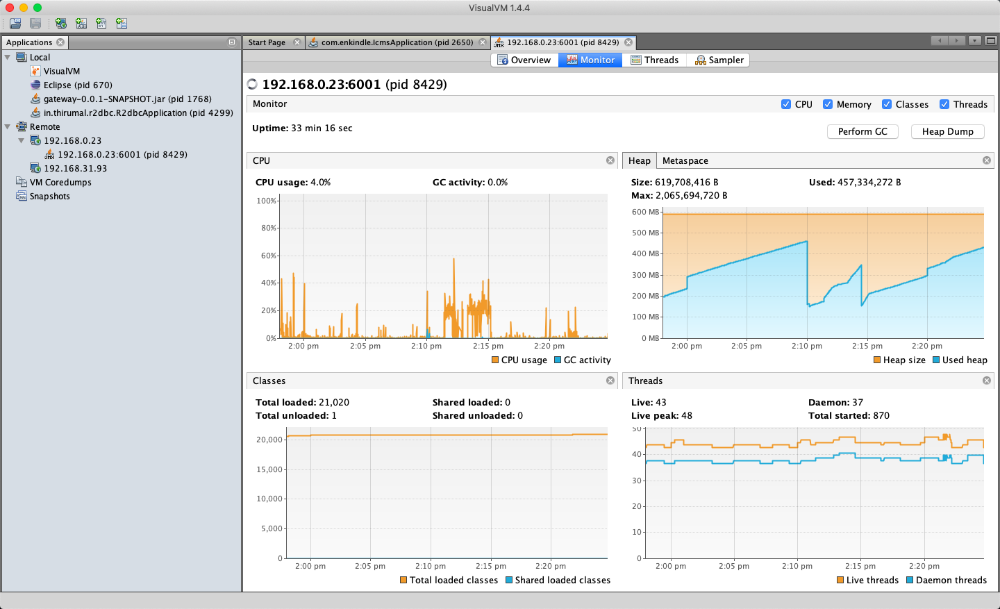

# How to set up remote visual VM 

1. Check if the `hostname` correctly resolves to the `host address`.  
    
2. Run `hostname -i` command. If it reports `127.0.0.1`, `JConsole` would not be able to connect to the JVM running on that Linux machine. 
	To fix this issue, edit `/etc/hosts` so that the `hostname` resolves to the `host address`
	
3. We need set the below properties while running jar

	-Dcom.sun.management.jmxremote=true 
	-Dcom.sun.management.jmxremote.port=<PORT> 
	-Dcom.sun.management.jmxremote.authenticate=false 
	-Dcom.sun.management.jmxremote.ssl=false 
	-Djava.rmi.server.hostname=<SEVER IP_ADDRESS> 
	-Dcom.sun.management.jmxremote.rmi.port=<PORT> 
	
4. Example
 
 	java -Dcom.sun.management.jmxremote=true -Dcom.sun.management.jmxremote.port=6001 -Dcom.sun.management.jmxremote.authenticate=false -Dcom.sun.management.jmxremote.ssl=false -Djava.rmi.server.hostname=192.168.0.23 -Dcom.sun.management.jmxremote.rmi.port=6001 -jar app-1.0.0-SNAPSHOT.jar 
   

   